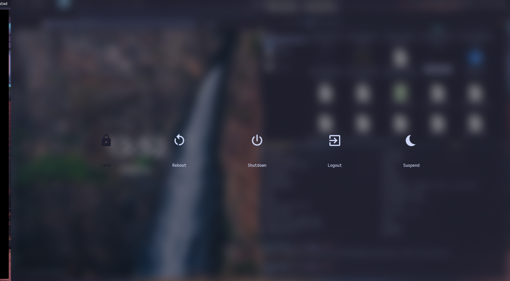

# hypr-dots

My current Thinkpad Arch Linux setup with Hyprland. Adapted from [gasech/hyprland-dots](https://github.com/gasech/hyprland-dots).

### Neovim
Custom Neovim config with Lazy.nvim. Still WIP.

### Screenshots

